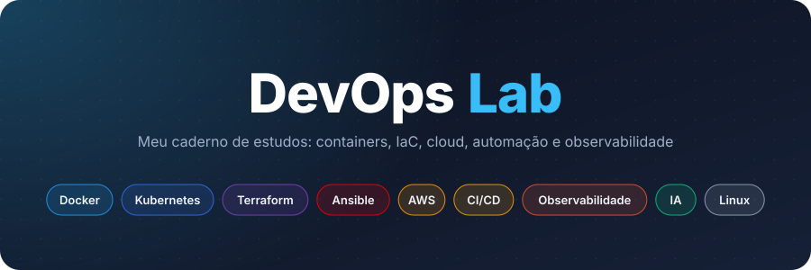
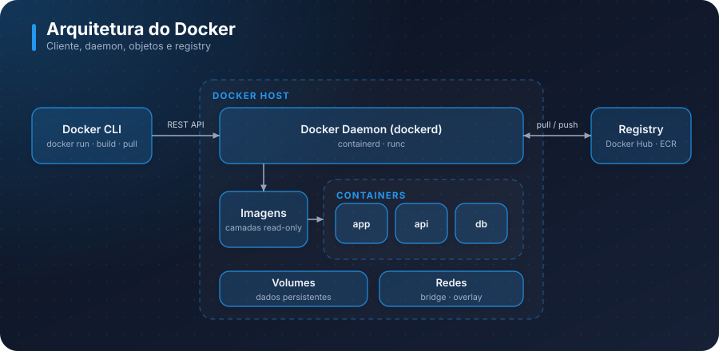
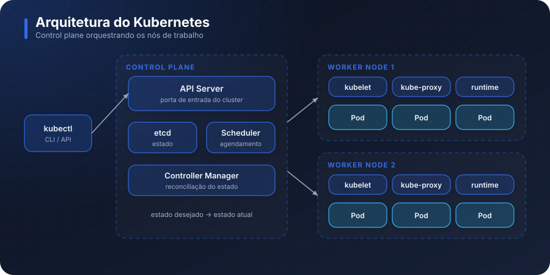
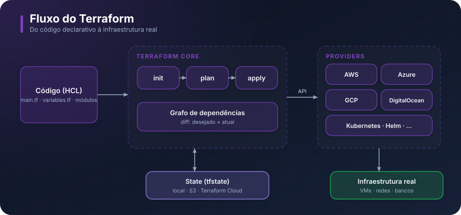
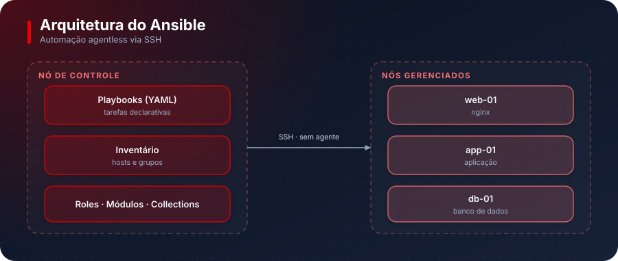
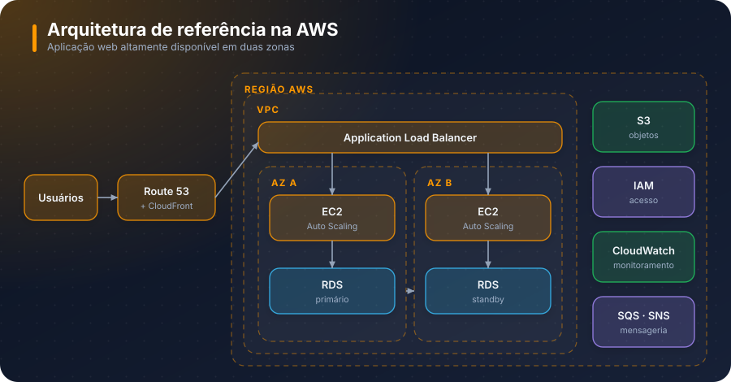
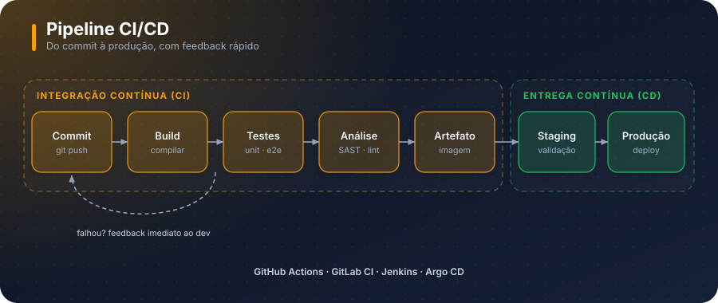
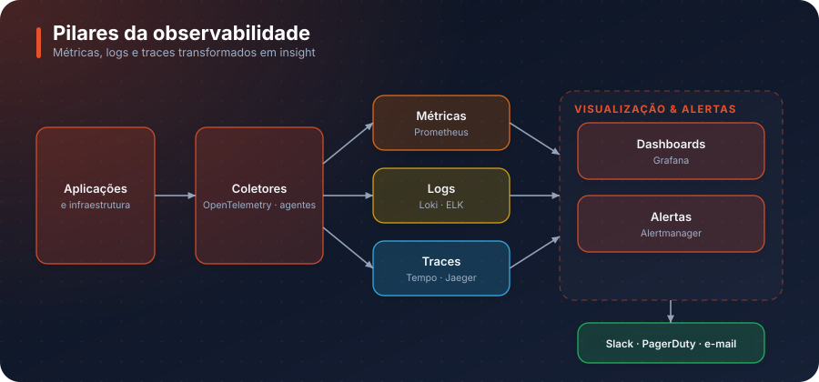
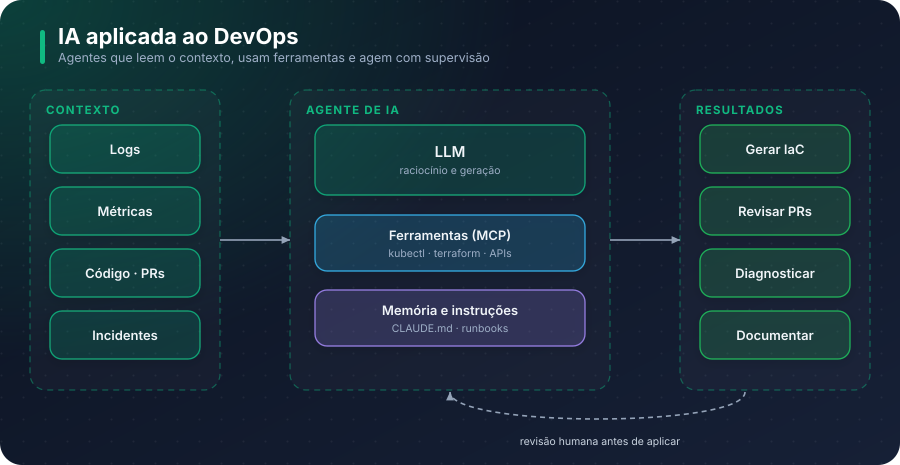

<div align="center">



<br>


</div>

Repositório que condensa todos os meus estudos de **DevOps**: anotações teóricas, resumos, comandos e laboratórios práticos, organizados por tema para que tudo seja fácil de encontrar.

---

## 🧭 Navegação rápida

| Tema | O que cobre | Pasta | Status |
| :-- | :-- | :-- | :-: |
| 🐳 [Docker](#-docker) | Containers e imagens | [`containers/docker`](containers/docker) | ✅ |
| ☸️ [Kubernetes](#️-kubernetes) | Orquestração de containers | [`containers/kubernetes`](containers/kubernetes) | ✅ |
| 🧱 [Terraform](#-terraform) | Infraestrutura como código | [`IaC/terraform`](IaC/terraform) | ✅ |
| 🛠️ [Ansible](#️-ansible) | Gerenciamento de configuração | `IaC/ansible` | 🚧 |
| ☁️ [AWS](#️-aws) | Cloud pública | [`cloud/aws`](cloud/aws) | 🚧 |
| 🔄 [CI/CD](#-cicd) | Pipelines e automação de entrega | `cicd/` | 🚧 |
| 📈 [Observabilidade](#-observabilidade) | Métricas, logs e traces | [`observabilidade`](observabilidade) | 🚧 |
| 🤖 [IA para DevOps](#-ia-para-devops) | Agentes e LLMs no dia a dia | [`IA-para-devops`](IA-para-devops) | 🚧 |
| 🐧 [Linux e Shell](#-linux-e-shell) | Sistema operacional e comandos | [`comandos-sistema-operacional`](comandos-sistema-operacional) | 🚧 |

> ✅ com conteúdo · 🚧 em andamento ou planejado

---

## 📦 Containers

### 🐳 Docker



O Docker empacota uma aplicação e suas dependências em uma **imagem** imutável, composta por camadas, que pode ser executada de forma idêntica em qualquer ambiente. Cada execução dessa imagem é um **container**: um processo isolado que compartilha o kernel do host, o que o torna muito mais leve que uma máquina virtual. O isolamento vem de recursos do kernel Linux, como *namespaces* (o que o processo enxerga) e *cgroups* (quanto ele pode consumir). A CLI conversa com o *daemon*, que gerencia imagens, containers, volumes e redes, e que baixa e envia imagens para um **registry**. Resolve o clássico "na minha máquina funciona" e é a base do ecossistema moderno de deploy.

📁 [Abrir estudos de Docker](containers/docker)

### ☸️ Kubernetes



O Kubernetes é uma plataforma de **orquestração de containers**: ele decide onde cada container roda, mantém a quantidade desejada de réplicas, reinicia o que falha e distribui o tráfego entre eles. Funciona de forma declarativa: você descreve o *estado desejado* e os controladores trabalham continuamente para fazer o estado real convergir para ele. O **control plane** (API Server, etcd, Scheduler e Controller Manager) toma as decisões, enquanto os **worker nodes** executam os *Pods*, a menor unidade de execução, por meio do kubelet e de um runtime de containers. Também abstrai rede, configuração, segredos e armazenamento.

📁 [Abrir estudos de Kubernetes](containers/kubernetes)

---

## 🏗️ Infraestrutura como Código

### 🧱 Terraform



O Terraform é uma ferramenta de **IaC declarativa** que permite descrever infraestrutura (servidores, redes, bancos, DNS) em arquivos de código na linguagem HCL, em vez de criá-la manualmente em consoles. O **Core** compara o que está no código com o que existe de fato, registrado no **state**, e calcula um plano com as mudanças necessárias antes de aplicá-las. A comunicação com cada plataforma é feita por **providers**, o que o torna agnóstico de cloud. Variáveis, outputs e módulos permitem reaproveitar e padronizar a infraestrutura, e o versionamento em Git traz revisão, histórico e reprodutibilidade.

📁 [Abrir estudos de Terraform](IaC/terraform)

### 🛠️ Ansible



O Ansible é uma ferramenta de **automação e gerenciamento de configuração**. Enquanto o Terraform costuma provisionar a infraestrutura, o Ansible configura o que roda dentro dela: instala pacotes, ajusta arquivos, gerencia serviços e usuários. Ele é *agentless*: um nó de controle se conecta aos servidores gerenciados via SSH, sem exigir software instalado neles. As tarefas são descritas em **playbooks** YAML, executadas por **módulos** e aplicadas sobre um **inventário** de hosts. Suas operações são pensadas para serem *idempotentes*, ou seja, rodar de novo não altera o que já está correto.

📁 `IaC/ansible` *(em breve)*

---

## ☁️ Cloud

### ☁️ AWS



A AWS é a maior plataforma de **cloud pública**, oferecendo infraestrutura sob demanda e paga conforme o uso. Seus serviços ficam organizados em **regiões**, que se dividem em **zonas de disponibilidade** (data centers isolados entre si) para garantir alta disponibilidade. Os blocos essenciais são computação (EC2, Lambda, EKS), rede (VPC, Route 53, ELB), armazenamento (S3, EBS), bancos de dados (RDS, DynamoDB) e segurança (IAM). Um conceito central é o **modelo de responsabilidade compartilhada**: a AWS protege a nuvem, e você protege o que coloca nela.

📁 [Abrir estudos de AWS](cloud/aws)

---

## 🔄 Automação

### 🔄 CI/CD



CI/CD é a prática de automatizar o caminho do código até a produção. A **Integração Contínua (CI)** faz build, testes e análises a cada mudança, detectando problemas cedo e com feedback rápido para quem desenvolveu. A **Entrega Contínua (CD)** leva o artefato aprovado por ambientes até a produção, de forma repetível e segura, com aprovação manual ou automática (*deployment*). Os pipelines são definidos como código e versionados junto da aplicação. Ferramentas comuns são GitHub Actions, GitLab CI, Jenkins e Argo CD, esta última seguindo a abordagem **GitOps**, em que o Git é a fonte da verdade do que está implantado.

📁 `cicd/` *(em breve)*

---

## 📈 Observabilidade



Observabilidade é a capacidade de entender o estado interno de um sistema a partir do que ele emite. Ela se apoia em três pilares: **métricas** (números ao longo do tempo, como CPU e latência), **logs** (registros de eventos) e **traces** (o caminho de uma requisição entre serviços). Diferente do monitoramento tradicional, que responde a perguntas já previstas, a observabilidade ajuda a investigar problemas inesperados. Dados coletados por agentes ou pelo OpenTelemetry são armazenados, visualizados em dashboards e transformados em **alertas** que acionam o time. Conceitos relacionados: SLI, SLO e error budget.

📁 [Abrir estudos de Observabilidade](observabilidade)

---

## 🤖 IA para DevOps



Uso de **LLMs e agentes de IA** para acelerar tarefas de engenharia e operação: gerar e revisar código de infraestrutura, analisar logs, diagnosticar incidentes, escrever documentação e automatizar rotinas. Um agente combina um modelo com **ferramentas** (como as expostas via MCP) e **contexto** (instruções do projeto, runbooks, histórico), podendo consultar sistemas e propor ações. A qualidade do resultado depende de bons prompts e de contexto bem organizado. Por lidar com ambientes reais, o uso exige **supervisão humana**, princípio do menor privilégio e cuidado com dados sensíveis.

📁 [Abrir estudos de IA para DevOps](IA-para-devops) · 📝 [Prompts reutilizáveis](prompts)

---

## 🐧 Linux e Shell

Base de praticamente tudo em DevOps: servidores, containers e pipelines rodam sobre **Linux**. Este tema reúne os conceitos de sistema operacional (processos, permissões, sistema de arquivos, rede, serviços) e a linha de comando, incluindo **shell script** para automatizar tarefas. Dominar o terminal e entender como o sistema funciona por baixo facilita o diagnóstico de problemas em qualquer outra ferramenta da lista.

📁 [Abrir comandos do sistema operacional](comandos-sistema-operacional)

---

## 🧪 Projetos práticos

| Projeto | Descrição |
| :-- | :-- |
| [`app-variaveis-ambiente`](projetos/app-variaveis-ambiente) | Aplicação de exemplo para estudar configuração via variáveis de ambiente, com pipeline no GitHub Actions. |

---

## 🗂️ Estrutura do repositório

```text
devops/
├── containers/                      # Docker e Kubernetes
├── IaC/                             # Terraform (e Ansible)
├── cloud/                           # AWS
├── observabilidade/                 # Métricas, logs e traces
├── IA-para-devops/                  # Agentes e LLMs
├── comandos-sistema-operacional/    # Linux e shell
├── projetos/                        # Laboratórios completos
├── prompts/                         # Prompts reutilizáveis
└── docs/imgs/                       # Diagramas usados neste README
```

---

<div align="center">
<sub>Feito com dedicação durante a jornada de estudos em DevOps. Em constante evolução. 🚀</sub>
</div>
